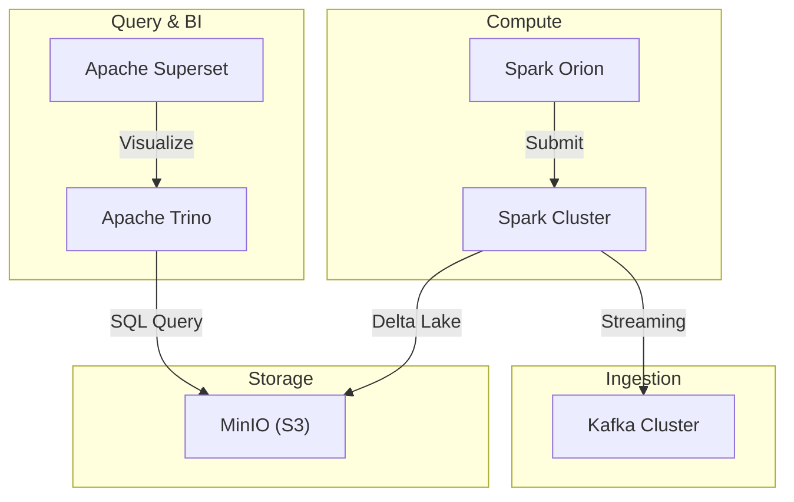

# Big Data Lakehouse Project Report

## Executive Summary
This project establishes a local Big Data Lakehouse environment using **MinIO** for storage, **Delta Lake** for table formatting, and **Apache Trino** for high-performance SQL analytics, visualized through **Apache Superset**.

## System Architecture

## Technical Architecture

### Core Stack
| Component | Technology | Role |
| :--- | :--- | :--- |
| **Storage** | MinIO | S3-compatible object storage for Delta tables. |
| **Format** | Delta Lake | ACID transactions and schema enforcement on S3. |
| **Compute** | Apache Spark | Data processing and table registration. |
| **Query Engine**| Apache Trino | SQL interface for high-performance table discovery. |
| **BI Layer** | Apache Superset | Dashboarding and SQL Lab visualization. |

### Component Details

#### 1. Object Storage (MinIO)
- **Deployment**: 4-node cluster.
- **Bucket**: `delta` (table data) and `lakehouse` (warehouse).
- **Endpoint**: `http://minio1:9000`.

#### 2. Query Layer (Trino)
- **Connector**: `delta_lake`
- **Metastore**: `file` (Self-contained metadata).
- **Automation**: `trino-init` container automates schema/table registration.

#### 3. Spark Job Orchestration (Spark Orion)
- **Interface**: Custom-built Notebook Workspace (Jupyter-alike).
- **Automation**: FastAPI backend handles `spark-submit` with automatic S3A and Delta Lake configurations.
- **Port**: `8000` (Access at `/portal/`).

#### 4. Streaming Layer (Kafka)
- **Deployment**: 3-node Kafka cluster with Zookeeper.
- **Integration**: Spark-Kafka connector (`spark-sql-kafka`) enabled for real-time Delta Lake ingestion.

## Major Challenges & Solutions

### JAR & Library Conflicts
- **Problem**: Mounting custom JARs over `/opt/spark/jars` deleted core Spark classes.
- **Solution**: Redirected custom mounts to `/opt/spark/external-jars` and dynamically loaded them via `--jars` in `spark-submit`.

### Kafka Connectivity
- **Problem**: Spark could not find the `kafka` data source.
- **Solution**: Injected `--packages org.apache.spark:spark-sql-kafka-0-10_2.12:3.5.0` into the orchestration backend.

## Setup Instructions
See the detailed [TUTORIAL.md](file:///c:/projets/bigdata-antigravity/TUTORIAL.md) in the root directory for a step-by-step execution guide.
